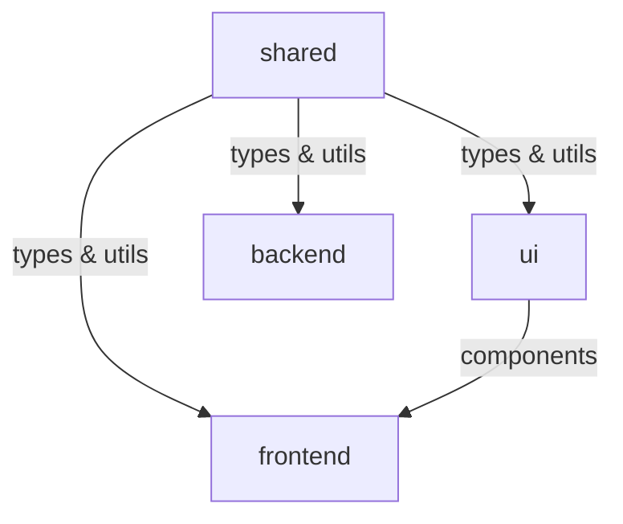
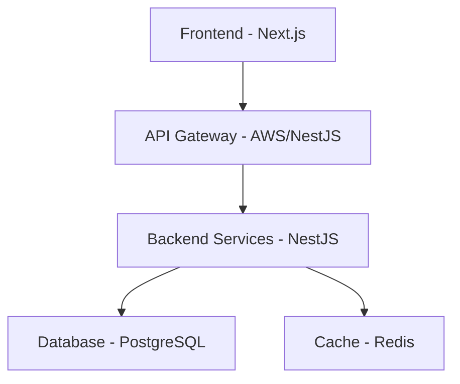

# Easylink

> A revolutionary job platform reimagining how students and employers connect in France.

## 🚀 Vision

Easylink is transforming the traditional job search experience into a modern, streamlined process. We're focusing initially on students seeking "alternance" (work-study) contracts in France, with plans to revolutionize professional networking.

### Key Innovations

- **True One-Click Applications**: Apply to multiple jobs instantly with customized profile versions
- **Dynamic Profile Pages**: Your profile is your resume, with unprecedented customization options
- **Multiple Profile Versions**: Tailor different versions of your profile for different industries
- **Smart Application Format**: Automatic conversion of applications to employer-preferred formats
- **Complete HR Suite**: End-to-end recruitment and team management tools for employers

## 📦 Package Structure

```
packages/
├── shared/            # Shared utilities, types, and constants
│   ├── types/        # Common TypeScript interfaces
│   ├── utils/        # Shared utility functions
│   └── validators/   # Shared validation schemas
│
├── ui/               # Shared UI component library
│   ├── components/   # shadcn/ui components
│   └── styles/      # TailwindCSS configurations
│
├── frontend/         # Next.js frontend application
│   ├── app/         # App router pages
│   ├── components/  # Frontend-specific components
│   └── lib/        # Frontend utilities
│
└── backend/         # NestJS backend service
    ├── src/        # Source code
    └── test/       # Test files
```

## 🔄 Package Dependencies



## 🛠 Technology Stack

### Core Architecture

- **Monorepo Management**: pnpm workspaces
- **Type Safety**: TypeScript
- **Code Quality**: ESLint, Prettier
- **Testing**: Jest, Playwright
- **Documentation**: TypeDoc
- **CI/CD**: GitHub Actions

### Frontend Layer

- **Framework**: Next.js 14
- **UI Components**: shadcn/ui
- **Styling**: TailwindCSS
- **State Management**: React Query
- **Forms**: Zod validation

### Backend Layer

- **Framework**: NestJS
- **Database**: PostgreSQL with Prisma
- **Caching**: Redis
- **API Documentation**: OpenAPI/Swagger
- **Security**: Helmet, CORS, Rate Limiting

### Infrastructure

- **Cloud**: AWS (Lambda, API Gateway)
- **Monitoring**: Datadog, Prometheus
- **Logging**: AWS CloudWatch
- **Email**: Resend

## 🛠 Technology Stack

### Core Architecture



### Frontend Layer

- **Framework**: Next.js + React + TypeScript
- **Styling**: Tailwind CSS
- **UI/UX**:
  - Lucide Icons
  - Inter & ABC Favorit Fonts
  - Priority Hints
  - Toast Notifications
- **Testing**:
  - Playwright (E2E)
  - Percy (Visual)

### Backend Layer

- **Framework**: NestJS with TypeScript
- **API Patterns**:
  - REST/GraphQL APIs
  - WebSocket Support
  - Built-in API Versioning
- **Database**:
  - PostgreSQL (Primary DB)
  - Prisma (ORM)
  - Prisma Studio (DB GUI)
- **Caching**: Redis
- **Testing**:
  - Jest (Unit)
  - Supertest (Integration)
- **Architecture**: Factory Pattern

### DevOps & Infrastructure

- **Hosting**:
  - Vercel (Frontend)
  - Railway (Backend)
  - AWS (Infrastructure)
  - Lambda (Serverless)
- **Monitoring**:
  - Datadog (Performance)
  - Sentry (Error Tracking)
  - LogRocket (User Sessions)
  - Prometheus (Metrics)
  - AWS CloudWatch (Logs)

### Security

- **API Security**:
  - JWT Middleware
  - Helmet
  - CORS
  - HSTS
  - Rate Limiting
- **Email**: Resend

### Development Tooling

- **Package Management**: pnpm
- **Documentation**: TypeDoc, OpenAPI/Swagger
- **Code Quality**:
  - ESLint
  - Prettier
  - Husky
- **API Testing**: Thunder Client
- **Database Management**: DataGrip
- **Version Control**: Git + Git Bisect
- **Release Management**: Semantic Release
- **Analytics**: Google Tag Manager

## 📦 Project Structure

```
packages/
├── frontend/           # Main web application
├── backend/           # Main API server
├── landing-page/      # Marketing site
├── admin-portal/      # Administrative interface
├── shared/           # Shared utilities, components, types
├── services/         # Core business services
└── microservices/    # Supporting services
```

## 🔄 Development Workflow

- **Project Management**: Notion for comprehensive project tracking
- **Version Control**: GitHub for issues and pull requests
- **Architecture**: Monorepo structure enabling parallel development across packages
- **Code Quality**: Strict PR review process and coding standards

## 🎯 Future Roadmap

Easylink will evolve into a comprehensive professional networking platform, featuring:

- Professional social networking
- Post sharing system
- Follow system
- Direct messaging
- Advanced networking features

## 👩‍💻 For Team Members

[Internal documentation and setup instructions to be added]

---

_Easylink - Simplifying the future of professional connections_
